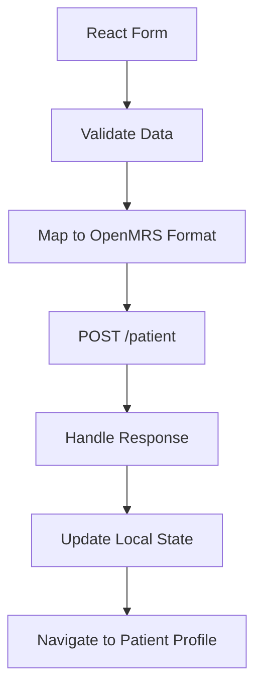
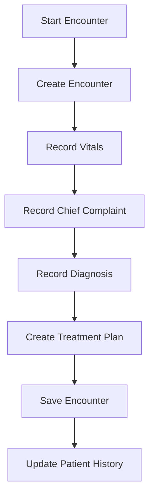
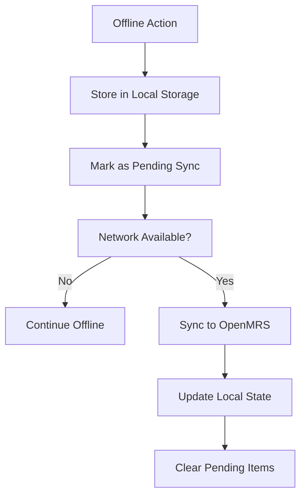

# Umzima Care v2 - System Architecture

## Overview

Umzima Care v2 is a digital health platform designed for small clinics in Kenya to create networked primary healthcare systems. This architecture document provides a comprehensive view of the system design, based on analysis of the OpenMRS core codebase and data model, integrated with Umzima Care's specific requirements for health equity and offline capabilities.

## Core Architecture Principles

### Health Equity First
- **Offline Resilience**: Core functions work without internet connectivity
- **Accessibility**: SMS-first communication, voice assistance, multilingual support
- **Affordability**: Modular adoption allowing clinics to scale features based on resources

### Technology Foundation
- **Backend**: OpenMRS 3 (O3) platform - Java-based EMR with modular architecture
- **Frontend**: React/TypeScript with modern UI components
- **Database**: MySQL/MariaDB with OpenMRS data model
- **Deployment**: Docker-based for portability and consistency

## System Components

### 1. OpenMRS 3 (O3) Backend Platform

#### Core Architecture (from OpenMRS Core Analysis)
```
OpenMRS Core (Java/Spring)
├── Platform Layer
│   ├── Module System
│   ├── Security Framework
│   └── Database Abstraction
├── API Layer
│   ├── REST Web Services
│   ├── FHIR2 Module
│   └── Legacy SOAP APIs
└── Data Layer
    ├── Hibernate ORM
    ├── MySQL/MariaDB
    └── OpenMRS Data Model
```

#### Key OpenMRS Components
- **Module System**: Extensible plugin architecture for custom functionality
- **Security**: Role-based access control with granular privileges
- **API Layer**: RESTful APIs for frontend integration
- **Data Model**: Patient-centric EMR with encounter-based clinical data

### 2. Umzima Care Frontend

#### React Application Architecture
```
src/
├── components/           # Reusable UI components
│   ├── common/          # Base components (Button, Input, etc.)
│   └── Layout/          # Layout components (Sidebar, TopBar)
├── pages/               # Route-based page components
├── services/            # OpenMRS API integration
├── context/             # React Context providers
├── types/               # TypeScript definitions
└── utils/               # Utility functions
```

#### Key Features
- **Responsive Design**: Mobile-first approach for clinic tablets
- **Offline Support**: Local storage and sync capabilities
- **Accessibility**: WCAG compliance, high contrast, screen reader support
- **Multilingual**: English/Swahili support with extensible language system

### 3. Database Architecture

#### OpenMRS Data Model (Analysis Results)
```
Core Entities:
├── Person (Base for all people)
│   ├── Patient (extends Person)
│   ├── User (extends Person)
│   └── Provider (extends Person)
├── Encounter (Clinical interactions)
│   └── Obs (Observations within encounters)
├── Visit (Patient visits spanning encounters)
├── Location (Clinic/facility hierarchy)
├── Concept (Medical terminology/codes)
└── Order (Prescriptions, referrals, etc.)
```

#### Key Relationships
- **Patient-Encounter**: One-to-many (patient can have multiple encounters)
- **Encounter-Obs**: One-to-many (encounter contains multiple observations)
- **Patient-Visit**: One-to-many (patient can have multiple visits)
- **Location-Encounter**: Many-to-one (encounters happen at specific locations)

## Integration Architecture

### OpenMRS REST API Integration

#### Primary Endpoints (Based on Core Analysis)
```typescript
// Patient Management
GET    /openmrs/ws/rest/v1/patient
POST   /openmrs/ws/rest/v1/patient
GET    /openmrs/ws/rest/v1/patient/{uuid}
PUT    /openmrs/ws/rest/v1/patient/{uuid}

// Encounters & Clinical Data
POST   /openmrs/ws/rest/v1/encounter
GET    /openmrs/ws/rest/v1/encounter?patient={uuid}
POST   /openmrs/ws/rest/v1/obs

// Appointments
GET    /openmrs/ws/rest/v1/appointmentscheduling/appointment
POST   /openmrs/ws/rest/v1/appointmentscheduling/appointment

// Authentication
GET    /openmrs/ws/rest/v1/session
POST   /openmrs/ws/rest/v1/session
DELETE /openmrs/ws/rest/v1/session
```

#### Authentication Flow
```
1. Basic Auth to /session endpoint
2. Receive JSESSIONID cookie
3. Include cookie in subsequent requests
4. Handle 401/403 with re-authentication
```

### Custom Module Architecture

#### SMS Integration Module
```java
// Custom OpenMRS Module Structure
org.openmrs.module.umzima/
├── api/
│   ├── UmzimaSMSService.java
│   └── SMSService.java
├── impl/
│   └── UmzimaSMSServiceImpl.java
├── web/
│   ├── controller/
│   │   └── SMSController.java
│   └── fragment/
│       └── smsForm.jsp
└── omod/
    ├── config.xml
    └── messages.properties
```

#### Module Responsibilities
- **SMS Gateway Integration**: Africa's Talking API
- **Appointment Reminders**: Scheduled SMS notifications
- **Two-way Communication**: Handle patient responses
- **Offline Queue**: Store messages when offline

## Data Flow Architecture

### Patient Registration Flow


### Clinical Encounter Flow


### Offline Synchronization Flow


## Security Architecture

### OpenMRS Security Model
- **Role-Based Access Control**: Admin, Doctor, Nurse, Patient roles
- **Privileges**: Granular permissions for specific operations
- **Session Management**: Secure cookie-based sessions
- **Data Encryption**: HTTPS transport, encrypted storage

### Umzima-Specific Security
- **Clinic-Level Isolation**: Location-based data access
- **Patient Consent**: SMS communication consent tracking
- **Audit Trail**: All data changes logged with user/timestamp
- **HIPAA Compliance**: Encryption and access controls

## Deployment Architecture

### Docker-Based Deployment
```yaml
# docker-compose.yml structure
version: '3.8'
services:
  openmrs-db:
    image: mariadb:10.6
    volumes:
      - db_data:/var/lib/mysql
    environment:
      MYSQL_ROOT_PASSWORD: ${MYSQL_ROOT_PASSWORD}
      MYSQL_DATABASE: openmrs
      MYSQL_USER: openmrs
      MYSQL_PASSWORD: ${MYSQL_PASSWORD}

  openmrs-backend:
    image: openmrs/openmrs-reference-application-3-backend:latest
    depends_on:
      - openmrs-db
    volumes:
      - modules:/openmrs/data/modules
      - app_data:/openmrs/data
    environment:
      DB_HOST: openmrs-db
      DB_NAME: openmrs
      DB_USER: openmrs
      DB_PASSWORD: ${MYSQL_PASSWORD}

  openmrs-frontend:
    image: openmrs/openmrs-reference-application-3-frontend:latest
    depends_on:
      - openmrs-backend
    ports:
      - "8080:80"

  umzima-frontend:
    build: ./frontend
    ports:
      - "3000:3000"
    depends_on:
      - openmrs-backend
```

### Production Considerations
- **Load Balancing**: Nginx reverse proxy for multiple instances
- **Database Replication**: Master-slave setup for high availability
- **Backup Strategy**: Automated database dumps and file backups
- **Monitoring**: Health checks and performance monitoring

## Module Architecture

### Custom Umzima Modules

#### 1. Umzima Core Module
- **Purpose**: Core Umzima-specific functionality
- **Components**:
  - Custom patient registration workflows
  - Enhanced search capabilities
  - Location-based access controls

#### 2. SMS Communication Module
- **Purpose**: SMS integration for patient communication
- **Components**:
  - Africa's Talking API integration
  - Appointment reminder scheduling
  - Two-way SMS handling
  - Offline message queuing

#### 3. Offline Synchronization Module
- **Purpose**: Handle offline data entry and sync
- **Components**:
  - Local data storage
  - Conflict resolution
  - Sync scheduling
  - Data validation

#### 4. CHW Integration Module
- **Purpose**: Support Community Health Worker workflows
- **Components**:
  - CHW-specific forms
  - Outreach tracking
  - Patient assignment
  - Reporting for CHW activities

## Data Architecture

### OpenMRS Data Model Extensions

#### Custom Tables (via Module)
```sql
-- CHW Patient Assignments
CREATE TABLE umzima_chw_assignment (
  chw_assignment_id INT PRIMARY KEY AUTO_INCREMENT,
  chw_id INT,
  patient_id INT,
  assignment_date DATETIME,
  status VARCHAR(50),
  FOREIGN KEY (chw_id) REFERENCES users(user_id),
  FOREIGN KEY (patient_id) REFERENCES patient(patient_id)
);

-- SMS Communication Log
CREATE TABLE umzima_sms_log (
  sms_log_id INT PRIMARY KEY AUTO_INCREMENT,
  patient_id INT,
  phone_number VARCHAR(20),
  message_text TEXT,
  direction ENUM('inbound', 'outbound'),
  status ENUM('sent', 'delivered', 'failed'),
  sent_date DATETIME,
  FOREIGN KEY (patient_id) REFERENCES patient(patient_id)
);

-- Offline Sync Queue
CREATE TABLE umzima_sync_queue (
  sync_queue_id INT PRIMARY KEY AUTO_INCREMENT,
  table_name VARCHAR(100),
  record_id INT,
  operation ENUM('insert', 'update', 'delete'),
  data JSON,
  created_date DATETIME,
  synced_date DATETIME NULL
);
```

### FHIR Integration Points

#### Key FHIR Resources
- **Patient**: Core patient demographics
- **Encounter**: Clinical interactions
- **Observation**: Clinical observations/vitals
- **Appointment**: Scheduling information
- **Location**: Facility information

## API Architecture

### REST API Design Patterns

#### Standard CRUD Operations
```typescript
interface CRUDOperations<T> {
  create(data: Partial<T>): Promise<T>;
  read(id: string): Promise<T>;
  update(id: string, data: Partial<T>): Promise<T>;
  delete(id: string): Promise<void>;
  list(params?: QueryParams): Promise<T[]>;
}
```

#### Pagination and Filtering
```typescript
interface QueryParams {
  page?: number;
  limit?: number;
  sort?: string;
  filter?: Record<string, any>;
  include?: string[];
}
```

### Error Handling
```typescript
interface APIError {
  code: string;
  message: string;
  details?: any;
  timestamp: string;
}
```

## Performance Architecture

### Caching Strategy
- **Browser Cache**: Static assets and API responses
- **Service Worker**: Offline functionality for PWA
- **Database Cache**: Frequently accessed data (concepts, locations)
- **CDN**: Static assets distribution

### Database Optimization
- **Indexing**: Key search fields (patient name, ID, phone)
- **Partitioning**: Large tables by date/location
- **Query Optimization**: Efficient JOIN operations
- **Connection Pooling**: Database connection management

## Monitoring and Observability

### Key Metrics
- **System Health**: Response times, error rates, uptime
- **User Activity**: Login frequency, feature usage
- **Data Quality**: Record completeness, validation errors
- **Performance**: Database query performance, API response times

### Logging Strategy
- **Application Logs**: User actions, system events
- **Audit Logs**: Data changes with user context
- **Error Logs**: System errors with stack traces
- **Performance Logs**: Slow queries and operations

## Migration and Upgrade Strategy

### From OpenMRS 2.x to 3.x
1. **Data Migration**: Export/import patient and clinical data
2. **Module Migration**: Rebuild custom modules for O3 architecture
3. **API Updates**: Update frontend to use new REST endpoints
4. **Testing**: Comprehensive testing of migrated data and workflows

### Version Compatibility
- **Backward Compatibility**: Maintain API compatibility where possible
- **Deprecation Strategy**: Clear timelines for breaking changes
- **Rollback Plan**: Ability to revert to previous versions

## Conclusion

This architecture provides a robust, scalable foundation for Umzima Care v2, leveraging OpenMRS 3's powerful platform while maintaining the flexibility needed for health equity-focused features. The modular design allows for incremental implementation and future enhancements, ensuring the system can grow with the needs of Kenyan clinics.

The integration between the React frontend and OpenMRS backend, combined with Docker deployment and offline capabilities, creates a comprehensive digital health solution that prioritizes accessibility, reliability, and user experience in resource-constrained environments.
